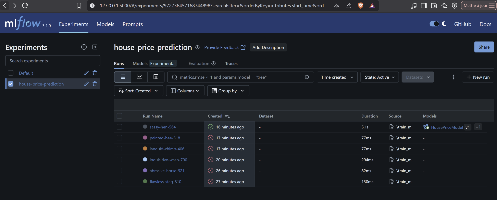
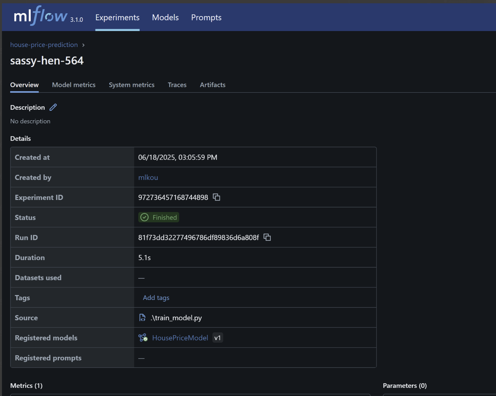
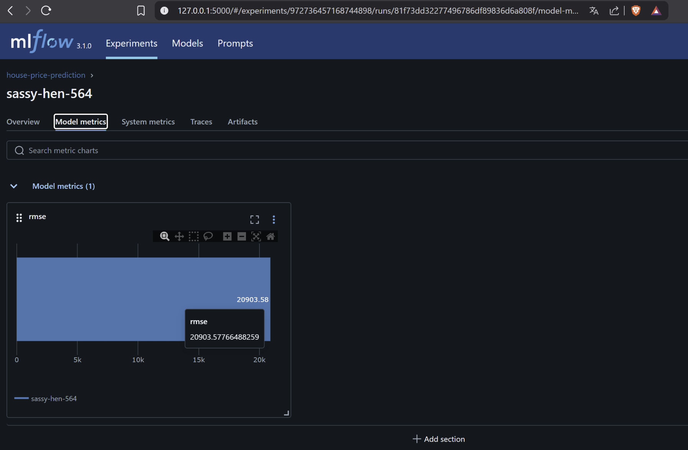

# MLOps House Price Prediction Project

## Objectif

Ce projet permet de déployer une API Flask pour la prédiction de prix de maisons via un modèle XGBoost, avec infrastructure provisionnée automatiquement sur AWS via Terraform, et une exécution des tâches de configuration par Ansible.

---

## 🌐 Prérequis

### 1. Clés AWS

* Créez le fichier `_credentials/aws_learner_lab_credentials`
* Exemple :

  ```ini
  [awslearnerlab]
  aws_access_key_id = YOUR_ACCESS_KEY_ID
  aws_secret_access_key = YOUR_SECRET_ACCESS_KEY
  ```

### 2. Clé SSH pour EC2

* Placez votre clé SSH privée `labuser.pem` dans le dossier `_credentials/`
* Donnez-lui les bons droits :

  ```bash
  chmod 400 _credentials/labuser.pem
  ```

### 3. Outils requis

Installez les outils suivants :

* [OpenTofu (Terraform fork)](https://opentofu.org/)
* Ansible
* Python 3.10+
* Docker (installé sur l'instance API via Ansible)

---

## 🚀 Étapes de déploiement

### 1. Clonez le projet

```bash
git clone https://github.com/koutamMoulaye/devops_mlops_price.git
cd devops_mlops_price
```

### 2. Provisionner l'infrastructure AWS

```bash
cd terraform

# Initialiser OpenTofu
tofu init
tofu plan

# Déployer les ressources
tofu apply
```

### 3. Générer automatiquement les hôtes Ansible

```bash
python generate_hosts.py
```

Ce script met à jour `ansible/hosts` avec les bonnes IP publiques.

### 4. Déployer les services avec Ansible

```bash
cd ../ansible

# Déployer l'API Flask sur l'instance API
ansible-playbook -i hosts playbooks/setup_api.yml

# Lancer l'entraînement du modèle sur l'instance ML
ansible-playbook -i hosts playbooks/setup_ml.yml
```

---

## Utilisation de l'API

Envoyez une requête POST vers l'API Flask avec un JSON d'exemple comme `sample_input.json`.
rendez vous d'avord à la racine du projet avant de tester

```powershell
Invoke-RestMethod -Uri http://<API_PUBLIC_IP>:5001/predict `
  -Method Post `
  -ContentType "application/json" `
  -InFile ".\data\processed\sample_input.json"
```

```bash
curl -X POST http://54.91.95.144:5001/predict \
     -H "Content-Type: application/json" \
     -d @data/processed/sample_input.json
```

---

## 📸 Visualisations MLflow

Aperçus des résultats et de l'entraînement :

<p align="center">
  
</p>

<p align="center">
  
</p>

<p align="center">
  
</p>

---

## 📁 Arborescence Simplifiée

```
devops_mlops_price/
├── ansible/
│   ├── playbooks/
│   │   ├── setup_api.yml
│   │   └── setup_ml.yml
│   └── hosts
├── terraform/
│   ├── main.tf
│   ├── output.tf
│   └── generate_hosts.py
├── src/
│   ├── prediction/app.py
│   └── training/train_model.py
├── data/
│   └── processed/sample_input.json
├── _credentials/
│   ├── aws_learner_lab_credentials
│   └── labuser.pem
├── image.png
├── image-1.png
├── image-2.png
└── README.md
```

## 🛠 Dépannage courant

### Erreur : `UNPROTECTED PRIVATE KEY FILE!`

Si vous obtenez cette erreur lors de l'exécution d'Ansible :

```
WARNING: UNPROTECTED PRIVATE KEY FILE!
Permissions 0777 for 'vockey.pem' are too open.
This private key will be ignored.
```

Cela signifie que les permissions de votre fichier `.pem` sont trop permissives.
Copier la clé dans un répertoire Linux natif (pas /mnt/c/) :
Corrigez-les avec cette commande :

```bash
mkdir -p ~/.ssh
cp /mnt/c/Users/<votre_user>/Desktop/devopsMops/_credentials/vockey.pem ~/.ssh/vockey.pem
chmod 400 ~/.ssh/vockey.pem
```

Modifier ansible/hosts pour utiliser le bon chemin :
```hosts file
[api]
<ip_api> ansible_user=ubuntu ansible_ssh_private_key_file=~/.ssh/vockey.pem

[training]
<ip_training> ansible_user=ubuntu ansible_ssh_private_key_file=~/.ssh/vockey.pem

```
Relancer Ansible :
```
cd ansible
ansible-playbook -i hosts playbooks/setup_api.yml

```

## Utilisation de l'API

Envoyez une requête POST vers l'API Flask avec un JSON d'exemple comme `sample_input.json`.
rendez vous d'avord à la racine du projet avant de tester

```powershell
Invoke-RestMethod -Uri http://<API_PUBLIC_IP>:5001/predict `
  -Method Post `
  -ContentType "application/json" `
  -InFile ".\data\processed\sample_input.json"
```

```bash
curl -X POST http://54.91.95.144:5001/predict \
     -H "Content-Type: application/json" \
     -d @data/processed/sample_input.json
```